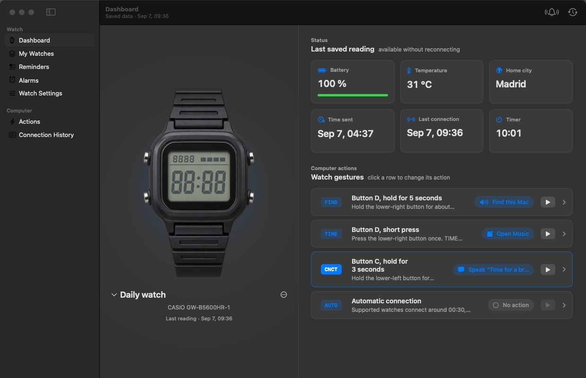
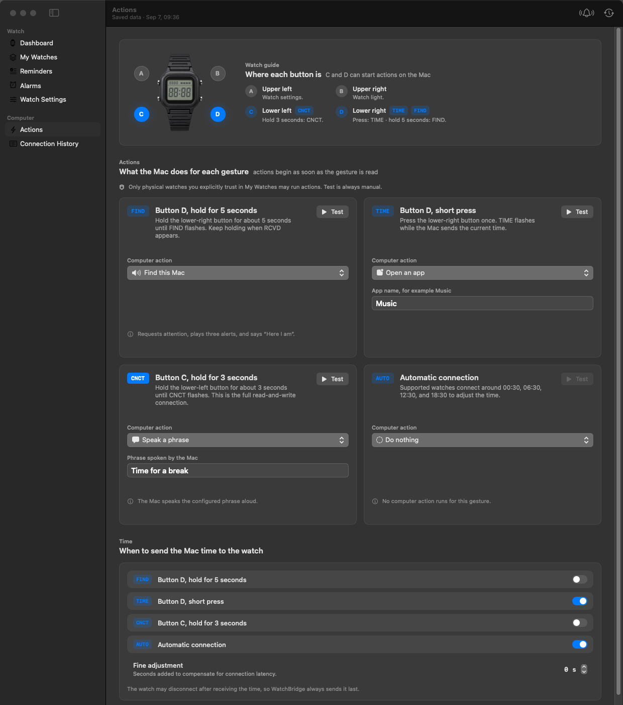
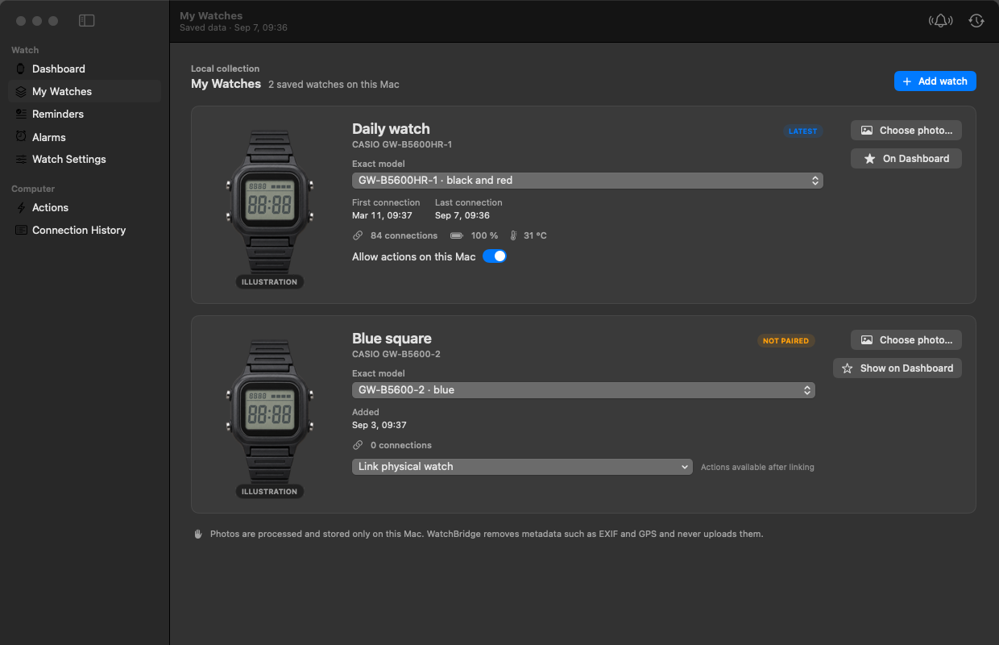

# WatchBridge · Casio G-SHOCK Watch Actions

**Supported watch gestures, useful computer actions, local data.**

[Downloads](https://github.com/WerrySs/watch-actions-gshock-casio/releases) · [CI builds](https://github.com/WerrySs/watch-actions-gshock-casio/actions/workflows/ci.yml) · [Compatibility](docs/COMPATIBILITY.md) · [Contribute](CONTRIBUTING.md) · [References](docs/REFERENCES.md)

WatchBridge connects supported Bluetooth watch gestures to actions on macOS and Windows. The application is called **WatchBridge**; the repository name describes the intended hardware.

> [!IMPORTANT]
> Independent, unofficial project. Not affiliated with, authorized by, sponsored by, endorsed by, or supported by Casio Computer Co., Ltd. CASIO and G-SHOCK are trademarks of their respective owner and are used only to identify compatible hardware. This is not an official Casio application.

> [!WARNING]
> **Private development preview, not a stable release.** Builds and automated tests are not a substitute for physical-watch acceptance tests. Preview packages are not Developer ID/notarized or Authenticode-signed unless their release explicitly states otherwise. Do not disable operating-system security protections to install them.



*macOS preview with sample data and the project's neutral watch illustration. Add your own local watch photo; WatchBridge does not download manufacturer photography.*

## Download the app

Open [Releases](https://github.com/WerrySs/watch-actions-gshock-casio/releases) and select a **private preview**:

| Computer | Package | Installation |
| --- | --- | --- |
| macOS 14+, Apple silicon or Intel | macOS-universal DMG or ZIP | Copy WatchBridge.app to Applications |
| Windows x64 | Windows-x64 ZIP | Extract the entire archive, then run WatchBridge.exe |

Every package has a SHA-256 checksum. Review the release notes and [installation guidance](docs/INSTALLATION.md) first. If there is no release for a commit yet, each successful [CI run](https://github.com/WerrySs/watch-actions-gshock-casio/actions/workflows/ci.yml) provides macOS and Windows review archives under **Artifacts**, retained for 14 days.

Windows 11 is the intended Mica experience. Windows 10 has a fallback appearance and needs separate acceptance testing. ARM64 Windows binaries and Linux are not distributed. You must be signed in with access to this private repository to download either platform.

## Supported device scope

The implementation is intentionally limited to the **GW-B5600 family / module 3461** and the variants listed in [Compatibility](docs/COMPATIBILITY.md). Other Casio families are not accepted merely because they advertise Bluetooth or work with another project.

- **FIND:** hold the lower-right D button for about five seconds.
- **TIME:** briefly press D from the timekeeping screen.
- **CNCT:** hold the lower-left C button for about three seconds.
- **AUTO:** an automatic connection reason, not a physical button.

These are short connection sessions, not continuous keyboard-like button events. No model/platform combination is advertised as fully hardware-certified yet.

## What is implemented

| Capability | macOS | Windows |
| --- | --- | --- |
| Desktop UI | SwiftUI/AppKit with native materials | Rust/Slint, with Mica requested on supported Windows versions |
| Bluetooth | CoreBluetooth | Windows BLE through btleplug |
| Saved watches, favorite and offline snapshots | Yes | Yes |
| Explicit physical-watch association and action trust | Yes | Yes |
| Connection history and action configuration | Yes | Yes |
| Local, metadata-free user watch photos | Yes | Not yet |
| Reminder, alarm and settings editors | Yes | Cached read-only views; editor parity pending |
| Shortcuts integration | macOS Shortcuts | Not yet |

Slint is not WinUI: both clients are compiled desktop apps, but their controls and feature sets are not identical. Their local JSON formats are also different; copying state files between platforms is not supported. See [Architecture](docs/ARCHITECTURE.md).

### Language and Dashboard controls

WatchBridge's interface and documentation are currently **English-only**, regardless of the system language. Dates and operating-system dialogs may use the system's regional settings. The older Spanish Swift prototype is a separate backup application, not a localized version of WatchBridge.

On macOS, click the watch name to choose the Dashboard watch or follow the most recently connected unit. The **…** menu groups the exact model, local photo and favorite setting. A saved reading is shown quietly: being offline between short sessions is normal. Choosing a Dashboard favorite does not change the physical target of queued watch settings.

## Explore the interface

<details>
<summary>Actions — physical button guide and aligned gesture cards</summary>

See where A, B, C and D are, configure each supported gesture, and choose when to send the time. Test buttons are manual actions; physical watches require explicit trust.



</details>

<details>
<summary>My Watches — collection, exact models, local photos and trust</summary>

Register a supported watch before pairing, link the physical unit explicitly, and keep a favorite on the Dashboard. Your last saved readings stay available offline.



</details>

These are offscreen previews of the macOS views with sample data, not evidence of Windows visual or physical-device testing. Native materials and controls vary with macOS version, window focus and desktop background. The Actions preview uses a taller window to show the full page; smaller windows scroll within the content area.

See [Validation and remaining acceptance work](docs/VALIDATION.md) for test scope, dependency maintenance notices and stable-release prerequisites.

## Safe by default

- Register a supported model before pairing, then explicitly link it to the chosen physical watch.
- Computer actions remain blocked until you authorize that physical unit. Linking does not grant trust.
- Unknown connection reasons fail closed. Configuration queues are scoped to a physical watch, never just a model or favorite.
- Legacy unassigned changes are preserved but never automatically sent; recreate them for the intended watch.
- Invalid or unreadable state pauses persistence and automatic actions instead of replacing the original with defaults.
- GUI application launches are separate from short-lived helper deadlines. Arbitrary shell-command actions are not supported.
- A dropped Bluetooth connection is not reported as a confirmed time sync.
- Watch readings remain visible offline and are last-known data, not continuous live telemetry.

Use hardware you control and keep backups. Do not rely on experimental Bluetooth actions for safety-critical tasks.

## Build and contribute

Requirements: rustup (the repo pins Rust 1.98.1), Swift 6.2+ on macOS, or MSVC C++ build tools and the Windows SDK on Windows. Native CI uses Xcode 26.3 and the Windows 2022 runner.

```console
git clone https://github.com/WerrySs/watch-actions-gshock-casio.git
cd watch-actions-gshock-casio
cargo test --locked --package watchbridge-core
```

macOS:

```console
cargo xtask prepare-macos
swift test --package-path apps/macos
swift run --package-path apps/macos WatchBridge
```

Windows:

```console
cargo test --locked --package watchbridge-windows
cargo run --locked --package watchbridge-windows
```

Read [Contributing](CONTRIBUTING.md), the [Code of Conduct](CODE_OF_CONDUCT.md), and the [Roadmap](docs/ROADMAP.md). Hardware support needs an exact-model, exact-platform test report, not just a new catalog entry. [Release instructions](docs/RELEASING.md) explain preview publishing and the stable-signing gate.

## Privacy and license

WatchBridge has no app account, analytics or automatic cloud upload. Data and imported photos stay on the computer. Actions you explicitly configure may open websites or invoke other applications with their own privacy behavior. Read [Privacy](PRIVACY.md), [Security](SECURITY.md) and [Support](SUPPORT.md).

Project source is under the [MIT License](LICENSE); dependencies retain their [own licenses](THIRD_PARTY_NOTICES.md). Responsible personal experimentation is the intended use, not an additional restriction on the MIT terms.
